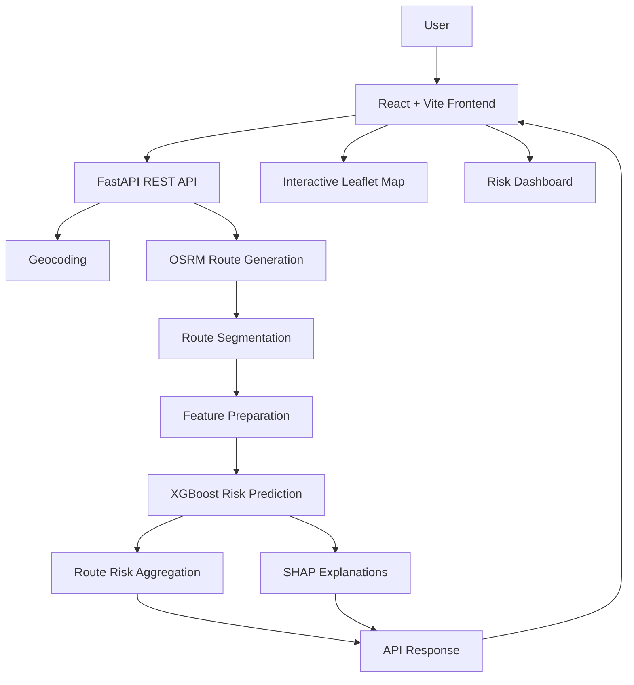

import pypandoc

readme = r'''# SafeRouteAI — Explainable Accident Risk Analysis for Routes

**An AI-powered route analysis platform that estimates accident risk across road segments using historical accident data and historical traffic-congestion features.**

SafeRouteAI helps users compare routes, identify potentially high-risk road segments, and understand the factors contributing to predicted accident risk through explainable AI.

> **Research & Demonstration Project:** SafeRouteAI produces model-based risk estimates from historical data. It does not guarantee accident prevention, provide live traffic or weather information, or replace responsible driving decisions.

---

## Overview

Choosing a route is not only about distance and estimated travel time. Understanding the historical accident risk associated with different road segments can provide another perspective when comparing possible journeys.

SafeRouteAI combines route planning, machine learning, geospatial analysis, and explainable AI in an interactive web application. Users enter a starting point and destination, receive alternative routes, explore segment-level risk estimates, and inspect the factors influencing those estimates.

The platform is designed as a research and demonstration dashboard focused on **interpretable, data-driven road risk analysis**.

## Key Features

- **Route Planning:** Enter a starting location and destination to generate route-risk analyses.
- **Alternative Route Comparison:** Compare available routes by predicted accident risk, distance, and estimated travel time.
- **Segment-Level Risk Scoring:** Analyze road segments of up to 400 metres and identify segments with elevated predicted risk.
- **Risk Classification:** Categorize model scores into four consistent risk levels.
- **Explainable AI:** Use SHAP explanations to examine factors contributing to a segment's predicted risk.
- **Historical Accident Context:** Display available information about nearby historical accidents and matched historical records.
- **Geospatial Visualization:** Explore routes and road segments on an interactive map.
- **Risk Summaries:** Review aggregate metrics, including high-risk segments, critical-risk segments, and average segment risk.
- **REST API Integration:** Connect the React frontend to a FastAPI backend.
- **Responsive Dashboard:** Present route analysis and model outputs through a user-friendly interface.

## Risk Classification

SafeRouteAI uses a risk score from 0 to 100.

| Risk Score | Risk Level | Indicator |
|---|---|---|
| 0–25 | Low | 🟢 |
| 26–50 | Moderate | 🟡 |
| 51–75 | High | 🟠 |
| 76–100 | Critical | 🔴 |

These scores represent the model's **predicted accident risk**, not a guaranteed probability that an accident will occur.

## How It Works

The application follows a route-analysis pipeline:

1. **Location Input:** The user enters a starting location and destination.
2. **Geocoding:** The backend converts the location descriptions into geographic coordinates.
3. **Route Generation:** OSRM provides candidate road routes between the coordinates.
4. **Route Segmentation:** The backend divides route geometry into road segments of up to 400 metres.
5. **Feature Preparation:** Available historical accident information and historical traffic-congestion features are used in the model's analysis.
6. **Risk Prediction:** An XGBoost model estimates accident risk for each segment.
7. **Risk Aggregation:** Segment predictions are summarized into route-level metrics.
8. **Explainability:** SHAP values help explain the features contributing to individual segment predictions.
9. **Visualization:** The frontend displays route alternatives, risk categories, segment details, and explanations.

### Architecture



## Technology Stack

| Layer | Technologies |
|---|---|
| Frontend | React 18, JavaScript, Vite |
| Styling | CSS |
| Mapping | Leaflet, React-Leaflet |
| HTTP Communication | Axios |
| Backend | Python, FastAPI |
| Routing | OSRM |
| Machine Learning | XGBoost |
| Explainable AI | SHAP |
| Geospatial Processing | Geographic coordinates and road-segment geometry |
| Data | Historical accident data and historical traffic-congestion features |

## Understanding the Dashboard

### Route Analysis

Each available route can include:

- Total distance in kilometres and miles
- Estimated travel time
- Overall predicted accident risk score and level
- Number of analyzed segments
- High-risk and critical-risk segment counts
- Average segment risk
- Highest-risk segment
- Available historical accident matching information

### Segment-Level Analysis

Each road segment can expose its identifier, road name, geographic location, distance along the route, risk score, risk classification, nearby historical accident information, and other fields returned by the backend.

Historical records may not be available for every segment. The absence of matched historical accidents does not establish that a road is accident-free.

### Explainable AI with SHAP

SHAP explanations help interpret how individual model features contribute to a prediction relative to the model's applicable reference output.

- **Positive SHAP value:** The feature pushes the model output in the direction associated with increased risk.
- **Negative SHAP value:** The feature pushes the model output in the direction associated with decreased risk.
- **Feature value:** The observed input value associated with the explanation.

SHAP values explain model behavior; they do not establish causation.

## API Overview

SafeRouteAI uses the following backend endpoints.

### Generate Route Risk Analysis

`POST /api/route-risk`

Request:

```json
{
  "start": "San Diego International Airport",
  "end": "Balboa Park, San Diego"
}
```

The response contains an analysis identifier, geocoded endpoints, contextual information, available routes, segment-level predictions, route summaries, route-comparison references, congestion features used, notes, and a disclaimer.

### Retrieve SHAP Explanations

`POST /api/explain`

Request:

```json
{
  "analysis_id": "ANALYSIS_ID_FROM_RESPONSE",
  "route_index": 0,
  "segment_id": "SEGMENT_ID_FROM_RESPONSE"
}
```

Use the actual `analysis_id` and `segment_id` returned by the backend. The segment identifier is optional when requesting an explanation at a broader scope supported by the API.

The response contains the explanation scope, units, and feature-level SHAP information, including feature labels, SHAP values, directions, and input values.

**Note:** The example identifiers above are placeholders, not actual analysis results.

## Installation and Local Development

### Prerequisites

- Node.js and npm
- Python and pip
- Git
- Access to the required model artifacts and historical data
- Any external routing or geocoding services required by the backend

### 1. Clone the repository

```bash
git clone https://github.com/jeev-17/AI-road-accident-blackspot-prediction-.git
cd AI-road-accident-blackspot-prediction-
```

### 2. Start the backend

Open a terminal in the actual backend directory.

Create and activate a Python virtual environment:

```bash
python -m venv .venv
```

Windows PowerShell:

```powershell
.\.venv\Scripts\Activate.ps1
```

Install the dependencies using the repository's existing dependency file:

```bash
pip install -r requirements.txt
```

Start the application using the FastAPI entry point configured in your repository. For example, if the entry point is `main.py` and the application object is named `app`:

```bash
uvicorn main:app --reload
```

The command above is an example; use the actual module and application object names from your backend. Confirm the API base URL and required configuration before proceeding.

### 3. Start the frontend

Open another terminal in the frontend directory:

```bash
npm install
npm run dev
```

Open the local URL printed by Vite.

Configure the frontend's API base URL to point to the running backend, using the environment variable or configuration mechanism already implemented in the project.

> **Configuration note:** The exact backend entry point, environment variable names, required model files, and dependency commands must match the repository's current implementation.

## Deployment

SafeRouteAI can be deployed as a frontend and backend application.

- **Frontend:** A static hosting service compatible with Vite.
- **Backend:** A Python hosting service that supports FastAPI and the required model artifacts.
- **Configuration:** Set the production API base URL, configure CORS, and provide required environment variables through the hosting provider's settings.
- **Model and data assets:** Ensure required files are available to the deployed backend.
- **External services:** Verify that routing and geocoding services are reachable and configured correctly.

The deployed frontend must call the actual backend URL rather than its local development address.

## Project Structure

The frontend is organized around the following component responsibilities:

```text
frontend/
├── src/
│   ├── components/
│   │   ├── Navbar
│   │   ├── RoutePlanner
│   │   ├── RiskLegend
│   │   ├── MapLayers
│   │   ├── MapView
│   │   ├── SegmentTable
│   │   ├── RouteRiskAnalysis
│   │   ├── RouteComparison
│   │   └── SHAPPanel
│   ├── services/
│   │   └── api.js
│   ├── common.js
│   ├── App.jsx
│   └── styles.css
└── package.json
```

This is a logical component overview. Adjust the paths to match the actual repository structure.

## Responsible Use and Limitations

- Risk scores are model predictions based on available historical data and the features used by the model.
- Historical accident records may be incomplete or unavailable for some segments.
- Historical traffic-congestion features are model inputs, not live traffic measurements.
- Routing times are estimates and are not based on live traffic.
- Model outputs depend on the quality, coverage, and representativeness of the underlying data.
- SHAP explanations describe model behavior and should not be interpreted as proof of causation.
- The application is intended for research and demonstration, not as a guarantee of route safety or accident probability.

**Always follow road rules, remain attentive, and make driving decisions using appropriate real-world information.**

## Future Improvements

Potential future directions include:

- More detailed model evaluation and calibration
- Temporal and geographic validation of accident-risk predictions
- Improved coverage and quality checks for historical accident data
- Additional interpretability and model-monitoring tools
- Accessibility improvements and richer map interactions
- Reproducible experiments and model-performance reporting
- Evaluation of prediction stability across different road types and conditions

These are possible extensions, not claims about existing functionality.

## Disclaimer

Risk predictions are generated from historical accident data and are intended for research and demonstration purposes. Predictions indicate estimated historical accident risk and should not be interpreted as guaranteed accident probability or a substitute for safe driving. Routing times are estimates and are not based on live traffic.


*SafeRouteAI — Making route-risk analysis more interpretable through machine learning and explainable insights.*
'''

output_path = "/mnt/data/README.md"
pypandoc.convert_text(readme, "md", format="md", outputfile=output_path, extra_args=["--standalone"])
print(f"Created {output_path}")

